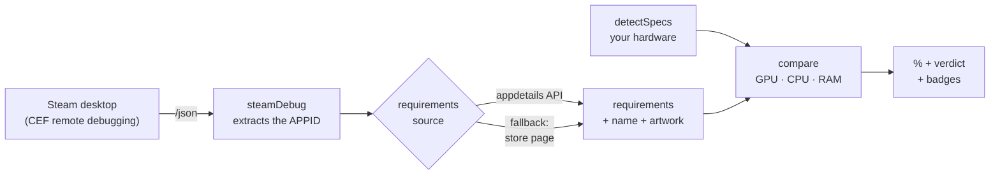

<div align="center">

🌐 **English** · [Português](README.pt-BR.md)

# Steam Spec Overlay

**Open a game's page on Steam. The overlay tells you, in seconds, if your PC can run it.**

No typing anything, no pasting anything, no looking up requirements yourself.

[](#)
[](#)
[](../../releases/latest)
[](#quality)
[](LICENSE)


</div>

---

## What it is

A desktop overlay that sits on top of the Steam window. It **detects on its own** which
game you're looking at, reads the minimum and recommended requirements, compares them
against your machine's real hardware, and shows compatibility as a percentage —
updating the instant you switch games.

> ⚠️ **Windows + the Steam desktop app only.** Doesn't work with Steam in a browser, or
> on macOS/Linux. And it isn't an in-game overlay — it's about the **store** window.

> 🐧 **Linux support is planned, not shipped yet.** See the
> [implementation plan](docs/LINUX-SUPPORT-PLAN.md) — 7 phases, task by task.

---

## How it works

Steam's desktop client is a Chromium (CEF) app that can expose a *remote debugging*
endpoint. The overlay reads that endpoint to find out which page is open —
**no OCR, no reading pixels, no scraping the native window**.



Two kinds of page are recognized:

| Page | How it's detected |
|---|---|
| **Store** | a CDP target whose URL is `store.steampowered.com/app/<APPID>` — works even behind the *age gate* |
| **Library** | the client creates an internal document whose URL carries the `/library/app/<APPID>` route |

Requirements come from Steam's **official** `appdetails` API (a ~5 KB JSON payload that
also carries the canonical name and the game's artwork). If the API doesn't know the
appid, it falls back to scraping the store page. If CEF debugging is off, there's a
**fallback mode** that reads the Steam window's title. The indicator at the top shows
which one is active: `CDP` (green) or `FALLBACK` (amber).

Everything is cached to disk: the second launch is instant, and a page you've already
opened keeps working **without internet**.

---

## Installation

**End user** — download from [Releases](../../releases/latest):

- `Steam Spec Overlay Setup 1.2.0.exe` — installer (creates a shortcut, lets you pick the folder)
- `Steam Spec Overlay 1.2.0.exe` — portable version, runs without installing

> The executable isn't signed (a code-signing certificate costs money), so Windows may
> show a SmartScreen warning on first run. **More info → Run anyway.**

**Development:**

```bash
npm install
npm start          # runs the overlay
npm run verify     # tables + self-check + 106 tests
npm run dist       # builds the NSIS installer + portable exe into dist/
```

Requires Node.js 18+ (tested on Node 24) and Windows.

---

## Required step: turning on CEF debugging

Steam only opens the debug port if there's an empty file called
`.cef-enable-remote-debugging` at the root of its install folder
(e.g. `C:\Program Files (x86)\Steam\.cef-enable-remote-debugging`).

**The app does this for you:**

1. Open the overlay. With no detection active, it shows an **"Ativar debug"** button —
   click it. It finds the Steam folder through the Windows registry and creates the file.
2. **Close Steam completely** (including the tray icon) and reopen it.
3. The indicator switches to `CDP` and the overlay starts detecting games on its own.

> If creating the file fails due to permissions, create an empty file with that exact
> name in the Steam folder yourself and restart Steam.

---

## Usage

<table>
<tr>
<td width="50%" valign="top" align="center">

<b>Recommended</b><br><sub>60% — "borderline, expect drops"</sub>
</td>
<td width="50%" valign="top" align="center">

<b>Minimum</b><br><sub>99% — "runs comfortably"</sub>
</td>
</tr>
</table>

- Open a game's page in the store or in your library. Within seconds you get the
  artwork, the name, the percentage meter and the **GPU / CPU / RAM** breakdown, plus
  badges for **SO** (OS) / DirectX / **Disco** (storage) / **64 bits**.
- Toggle between **Recomendado** (Recommended) and **Mínimo** (Minimum) at the top —
  the choice is remembered.
- Switching games updates automatically. Leaving the page puts the overlay on standby.
- Global shortcut **`Ctrl+Shift+S`** to show/hide. If that combo is taken, it tries
  `Ctrl+Alt+S`, then `Ctrl+Shift+F10`; the active shortcut shows up in settings.
- Global shortcut **`Ctrl+Alt+C`** always turns click-through off and brings the window
  to the front (fallback `Ctrl+Shift+C`, then `Ctrl+Shift+F11`). Since click-through
  makes the window ignore every click — including the checkbox that turns it off —
  show/hide (`Ctrl+Shift+S`) alone can't fix that; this shortcut exists specifically to
  unstick the app without needing to click on it.
- **Tray icon** with show/hide, always-on-top, click-through, start with Windows, and
  quit. It's also the recovery route if no global shortcut is free.
- Drag by the title bar to reposition — the position is remembered.

<table>
<tr>
<td width="50%" valign="top" align="center">

<b>Settings</b><br><sub>opacity, click-through, autostart…</sub>
</td>
<td width="50%" valign="top" align="center">

<b>Compact mode</b><br><sub>meter only, 316px tall</sub>
</td>
</tr>
</table>

Settings, cache and logs live under `%APPDATA%\steam-spec-overlay\` — the **Abrir pasta
de dados** (Open data folder) button goes straight there.

<sub>The screenshots use a reference PC (i5-12400F · RTX 3060 · 16 GB); the app shows
your machine's real hardware.</sub>

---

## How the percentage is calculated

1. Each requirement field is compared against the machine's real spec.
2. **GPU and CPU** become a ratio, `your score / required score`, using internal
   benchmark tables, and that ratio runs through a curve: matching the requirement
   exactly scores **70**; 1.4× or more scores **100**.
3. **RAM** uses the same curve over GB.
4. Scores combine with weights **GPU 45% · CPU 35% · RAM 20%**, renormalized **only
   over the components that were identified** — an unidentified component is excluded
   from the math, never guessed at.

The rules that most often change the result in practice:

| Rule | Example |
|---|---|
| **"or" means the weakest one** | `GTX 1060 or RX 580 or Arc A380` is satisfied by any of them → the Arc A380 is the bar |
| **Exclusion clauses are dropped** | `RX 580 (Intel UHD 630 not supported)` doesn't let the UHD become the requirement |
| **VRAM is a separate gate** | a faster card with less VRAM than the game asks for has its score capped by that |
| **Generic CPU requirements** | `4 hardware CPU threads`, `Dual core 2.8 GHz` become a direct comparison of cores/threads/clock |
| **A model outside the table is estimated** | interpolated between neighbors in the same family and generation, flagged with `≈` and the **ESTIMADO** (estimated) badge — never presented as a measurement |
| **Squashed names are understood** | `GTX1060`, `HD2600`, `9600GT`, `RX6600XT` |

---

## Limitations

- **The % is an estimate, not a measurement.** Store requirement text is free-form and
  imprecise ("or better", "equivalent"). Treat it as an order of magnitude.
- The benchmark tables are **internal and estimated**: 349 GPUs and 388 CPUs. If your
  component shows up as "não identificado" (not identified), it's not in the table and
  couldn't be estimated either — just add a line (lowercase key → relative score) and
  run `npm run verify`.
- The **DirectX** badge reflects what your Windows exposes; the real feature level also
  depends on the GPU. That's why it's informational and kept out of the score.
- Detection depends on the Steam client's behavior (the debug flag, the CDP port). Valve
  can change that, which is why the fallback mode exists.
- Console-only games, or ones with no PC requirements block, show up as
  **"requisitos indisponíveis"** (requirements unavailable).

---

## Quality

```bash
npm run verify
```

Runs three gates in sequence:

| Gate | What it checks |
|---|---|
| `scripts/validate-tables.js` | duplicates, keys the matcher can never reach, monotonicity within each family/generation, and ordering anchors |
| `scripts/selfcheck.js` | an end-to-end smoke test with no network and no Electron — including whether every `window.api.*` the renderer uses exists in the preload **and** has a handler in main |
| `node --test` | 106 unit tests |

---

## Rolling back to a previous version

This repository's history keeps both earlier versions as tags:

```bash
git checkout v0.1.0    # original version
git checkout v1.0.0    # earlier stable version
git checkout main      # back to the top
```

To run the old version: `git checkout v0.1.0 && npm install && npm start`.
What changed between them is in [CHANGELOG.md](CHANGELOG.md).

---

## Structure

```
steam-spec-overlay/
  main.js                     Electron process: window + tray + orchestration + IPC
  preload.js                  secure main↔renderer bridge (contextIsolation)
  index.html
  styles.css
  renderer.js                 overlay UI (HUD)
  lib/
    steamDebug.js             finds the CDP port, reads /json, extracts the appid (store + library)
    steamSetup.js             finds the Steam folder (registry), creates the debug flag
    steamApi.js               appdetails API + page fallback + cache + artwork
    steamScraper.js           parsing of requirement blocks (fragment and full page)
    detectSpecs.js            the real machine specs (systeminformation), cached
    compare.js                CPU/GPU matching, "or" semantics, estimator, % calculation
    extras.js                 OS / DirectX / storage / 64-bit
    windowFallback.js         plan B via window title (tasklist)
    settings.js               persistent, validated preferences
    cache.js                  disk cache with TTL and stale reads
    logger.js                 rotating file log
    jsonFile.js               JSON read/write that survives a corrupted file
    appPaths.js               resolves the data directory (Electron or plain Node)
  data/
    cpu-benchmarks.json       388 entries
    gpu-benchmarks.json       349 entries
  scripts/
    make-icon.js              generates the app icon in code (PNG + ICO, no external asset)
    validate-tables.js        checks the benchmark tables for consistency
    selfcheck.js              smoke test of the whole pipeline
  test/                       106 tests (node:test)
```

The app icon isn't a hand-drawn file — it's [rendered in
code](scripts/make-icon.js) in plain Node (a PNG encoder over `zlib` + an ICO container
with BMP entries), so `npm run icons` regenerates all of it on any machine.

---

## License

[MIT](LICENSE).
