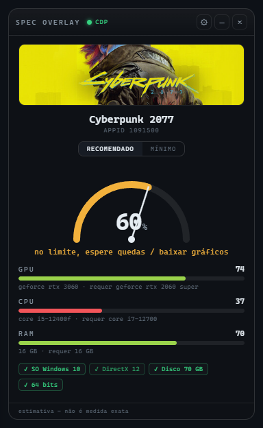
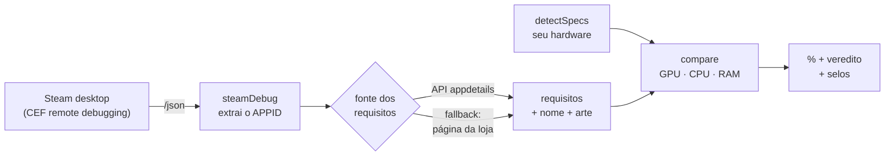
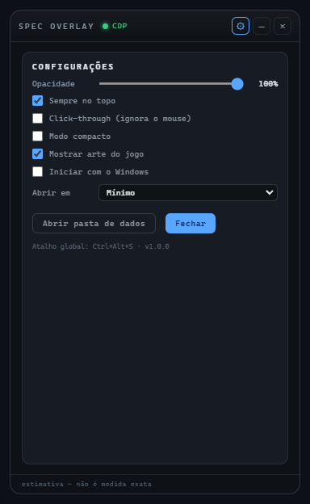
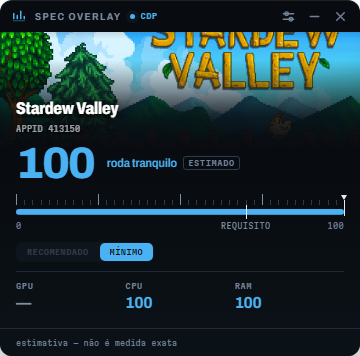

<div align="center">

🌐 [English](README.md) · **Português**

# Steam Spec Overlay

**Abra a página de um jogo na Steam. O overlay diz, em segundos, se o seu PC roda.**

Sem digitar nada, sem colar nada, sem procurar os requisitos.

[](#)
[](#)
[](../../releases/latest)
[](#qualidade)
[](LICENSE)



</div>

---

## O que é

Um overlay de desktop que fica por cima da janela da Steam. Ele **detecta sozinho** qual
jogo você está olhando, lê os requisitos mínimos e recomendados, compara com o hardware
real da sua máquina e mostra a compatibilidade em porcentagem — atualizando na hora em que
você troca de jogo.

> ⚠️ **Só Windows + app desktop da Steam.** Não funciona com a Steam no navegador, nem no
> macOS/Linux. E não é um overlay dentro do jogo — é sobre a janela da **loja**.

> 🐧 **Suporte a Linux está planejado, ainda não lançado.** Veja o
> [plano de implementação](docs/LINUX-SUPPORT-PLAN.md) — 7 fases, tarefa por tarefa.

---

## Como funciona

O cliente desktop da Steam é uma aplicação Chromium (CEF) que pode expor um endpoint de
*remote debugging*. O overlay lê esse endpoint para descobrir qual página está aberta —
**sem OCR, sem ler pixels, sem scraping da janela nativa**.



Dois tipos de página são reconhecidos:

| Página | Como é detectada |
|---|---|
| **Loja** | target CDP com URL `store.steampowered.com/app/<APPID>` — funciona até por trás do *age gate* |
| **Biblioteca** | o cliente cria um documento interno cuja URL carrega a rota `/library/app/<APPID>` |

Os requisitos vêm da **API oficial** `appdetails` da Steam (JSON de ~5 KB, que ainda traz o
nome canônico e a arte do jogo). Se a API não conhecer o appid, cai para o scraping da
página da loja. Se o debug do CEF estiver desligado, existe um **modo fallback** que lê o
título da janela da Steam. O indicador no topo mostra qual está ativo: `CDP` (verde) ou
`FALLBACK` (âmbar).

Tudo é cacheado em disco: o segundo start é instantâneo e uma página que você já abriu
continua funcionando **sem internet**.

---

## Instalação

**Usuário final** — baixe em [Releases](../../releases/latest):

- `Steam Spec Overlay Setup 1.2.0.exe` — instalador (cria atalho, permite escolher a pasta)
- `Steam Spec Overlay 1.2.0.exe` — versão portable, roda sem instalar

> O executável não é assinado (certificado de code signing é pago), então o Windows pode
> mostrar um aviso do SmartScreen na primeira execução. **Mais informações → Executar
> assim mesmo.**

**Desenvolvimento:**

```bash
npm install
npm start          # roda o overlay
npm run verify     # tabelas + self-check + 106 testes
npm run dist       # gera instalador NSIS + portable em dist/
```

Requer Node.js 18+ (testado no Node 24) e Windows.

---

## Passo obrigatório: ligar o debug do CEF

A Steam só abre a porta de debug se existir um arquivo vazio chamado
`.cef-enable-remote-debugging` na raiz da pasta de instalação dela
(ex.: `C:\Program Files (x86)\Steam\.cef-enable-remote-debugging`).

**O app faz isso pra você:**

1. Abra o overlay. Sem detecção ativa, ele mostra o botão **“Ativar debug”** — clique. Ele
   acha a pasta da Steam pelo registro do Windows e cria o arquivo.
2. **Feche a Steam por completo** (inclusive o ícone na bandeja) e abra de novo.
3. O indicador vira `CDP` e o overlay passa a detectar os jogos sozinho.

> Se a criação falhar por permissão, crie manualmente um arquivo vazio com esse nome na
> pasta da Steam e reinicie a Steam.

---

## Uso

<table>
<tr>
<td width="50%" valign="top" align="center">

<b>Recomendado</b><br><sub>60% — “no limite, espere quedas”</sub>
</td>
<td width="50%" valign="top" align="center">

<b>Mínimo</b><br><sub>99% — “roda tranquilo”</sub>
</td>
</tr>
</table>

- Abra a página de um jogo na loja ou na sua biblioteca. Em segundos aparecem a arte, o
  nome, o medidor em % e a quebra por **GPU / CPU / RAM**, mais os selos de
  **SO / DirectX / disco / 64 bits**.
- Alterne entre **Recomendado** e **Mínimo** no topo — a escolha fica salva.
- Trocar de jogo atualiza sozinho. Sair da página deixa o overlay em espera.
- Atalho global **`Ctrl+Shift+S`** para mostrar/esconder. Se o combo estiver ocupado, ele
  tenta `Ctrl+Alt+S` e depois `Ctrl+Shift+F10`; o atalho ativo aparece nas configurações.
- Atalho global **`Ctrl+Alt+C`** sempre desliga o click-through e traz a janela pra frente
  (fallback `Ctrl+Shift+C`, depois `Ctrl+Shift+F11`). Como o click-through faz a janela
  ignorar todo clique — inclusive no próprio checkbox que o desliga — mostrar/esconder
  (`Ctrl+Shift+S`) sozinho não resolve; esse atalho existe justamente pra destravar o app
  sem precisar clicar nele.
- **Ícone na bandeja** com mostrar/esconder, sempre-no-topo, click-through, iniciar com o
  Windows e sair. É também a rota de recuperação se nenhum atalho global estiver livre.
- Arraste pela barra de título para reposicionar — a posição é lembrada.

<table>
<tr>
<td width="50%" valign="top" align="center">

<b>Configurações</b><br><sub>opacidade, click-through, autostart…</sub>
</td>
<td width="50%" valign="top" align="center">

<b>Modo compacto</b><br><sub>só o medidor, ocupa 316px</sub>
</td>
</tr>
</table>

Configurações, cache e log ficam em `%APPDATA%\steam-spec-overlay\` — o botão **Abrir
pasta de dados** leva direto lá.

<sub>As capturas usam um PC de referência (i5-12400F · RTX 3060 · 16 GB); o app mostra o
hardware real da sua máquina.</sub>

---

## Como a porcentagem é calculada

1. Cada campo do requisito é comparado contra a spec real da máquina.
2. **GPU e CPU** viram uma razão `pontuação sua / pontuação exigida` usando as tabelas
   internas de benchmark, e essa razão passa por uma curva: empatar com o requisito vale
   **70**; ter 1,4× ou mais vale **100**.
3. **RAM** usa a mesma curva sobre GB.
4. As notas entram com pesos **GPU 45% · CPU 35% · RAM 20%**, renormalizados **apenas
   sobre os componentes identificados** — um componente desconhecido é excluído da conta,
   nunca chutado.

As regras que mais mudam o resultado na prática:

| Regra | Exemplo |
|---|---|
| **“ou” significa o mais fraco** | `GTX 1060 ou RX 580 ou Arc A380` é atendido por qualquer uma → a régua é a Arc A380 |
| **Cláusula de exclusão é descartada** | `RX 580 (Intel UHD 630 não suportada)` não deixa a UHD virar o requisito |
| **VRAM é um portão à parte** | placa mais rápida, mas com menos VRAM do que o jogo pede, tem a nota limitada por isso |
| **Requisito genérico de CPU** | `4 hardware CPU threads`, `Dual core 2.8 GHz` viram comparação direta de núcleos/threads/clock |
| **Modelo fora da tabela é estimado** | interpolado entre os vizinhos da mesma família e geração, marcado com `≈` e o selo `ESTIMADO` — nunca apresentado como medição |
| **Nomes colados são entendidos** | `GTX1060`, `HD2600`, `9600GT`, `RX6600XT` |

---

## Limitações

- **A % é uma estimativa, não uma medida.** Requisito de loja é texto livre e impreciso
  (“or better”, “equivalent”). Use como ordem de grandeza.
- As tabelas de benchmark são **internas e estimadas**: 349 GPUs e 388 CPUs. Se o seu
  componente aparecer como “não identificado”, ele não está na tabela nem foi estimável —
  basta acrescentar a linha (chave minúscula → pontuação relativa) e rodar
  `npm run verify`.
- O selo de **DirectX** reflete o que o seu Windows expõe; o nível real também depende do
  *feature level* da GPU. Por isso é informativo e fica fora do cálculo.
- A detecção depende do comportamento do cliente Steam (flag de debug, porta CDP). A Valve
  pode mudar isso; por isso existe o modo fallback.
- Jogos só-console ou sem bloco de requisitos de PC aparecem como
  **“requisitos indisponíveis”**.

---

## Qualidade

```bash
npm run verify
```

Roda três gates em sequência:

| Gate | O que checa |
|---|---|
| `scripts/validate-tables.js` | duplicatas, chaves inalcançáveis pelo matcher, monotonicidade dentro de cada família/geração e âncoras de ordenação |
| `scripts/selfcheck.js` | smoke test ponta a ponta sem rede e sem Electron — inclusive se todo `window.api.*` usado pelo renderer existe no preload **e** tem handler no main |
| `node --test` | 106 testes unitários |

---

## Voltando para uma versão anterior

O histórico deste repositório guarda as duas versões como tags:

```bash
git checkout v0.1.0    # versão original
git checkout v1.0.0    # versão atual
git checkout main      # volta para o topo
```

Para rodar a versão antiga: `git checkout v0.1.0 && npm install && npm start`.
O que mudou entre elas está no [CHANGELOG.pt-BR.md](CHANGELOG.pt-BR.md).

---

## Estrutura

```
steam-spec-overlay/
  main.js                 processo Electron: janela + bandeja + orquestração + IPC
  preload.js              ponte segura main↔renderer (contextIsolation)
  index.html
  styles.css
  renderer.js             UI do overlay (HUD)
  lib/
    steamDebug.js         acha a porta CDP, lê /json, extrai o appid (loja + biblioteca)
    steamSetup.js         acha a pasta da Steam (registro), cria o flag de debug
    steamApi.js           API appdetails + fallback de página + cache + arte
    steamScraper.js       parsing dos blocos de requisito (fragmento e página)
    detectSpecs.js        specs reais da máquina (systeminformation), com cache
    compare.js            matching CPU/GPU, semântica de "ou", estimador, cálculo da %
    extras.js             SO / DirectX / disco / 64 bits
    windowFallback.js     plano B via título de janela (tasklist)
    settings.js           preferências persistentes e validadas
    cache.js              cache em disco com TTL e leitura stale
    logger.js             log rotativo em arquivo
    jsonFile.js           leitura/escrita JSON à prova de arquivo corrompido
    appPaths.js           resolve o diretório de dados (Electron ou Node puro)
  data/
    cpu-benchmarks.json   388 entradas
    gpu-benchmarks.json   349 entradas
  scripts/
    make-icon.js          gera o ícone do app por código (PNG + ICO, sem asset externo)
    validate-tables.js    valida a coerência das tabelas de benchmark
    selfcheck.js          smoke test do pipeline inteiro
  test/                   106 testes (node:test)
```

O ícone do app não é um arquivo desenhado à mão — é [renderado por
código](scripts/make-icon.js) em Node puro (encoder PNG sobre `zlib` + container ICO com
entradas BMP), então `npm run icons` regenera tudo em qualquer máquina.

---

## Licença

[MIT](LICENSE).
